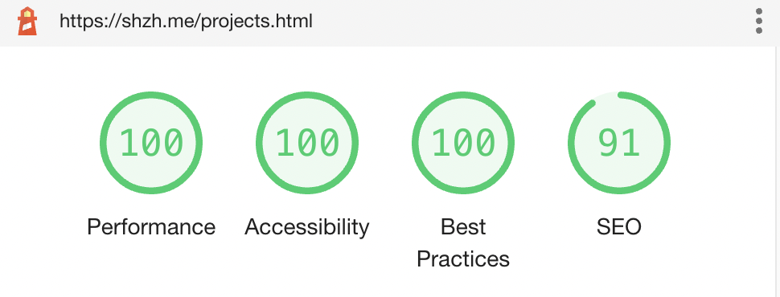
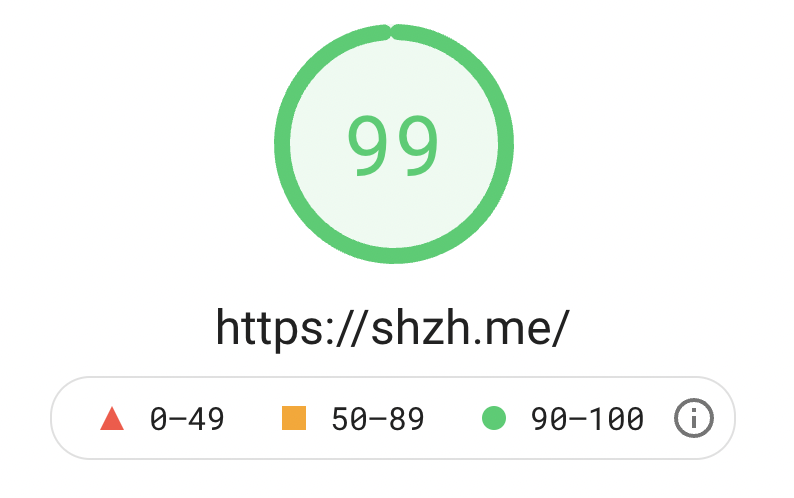

<h1 align="center">ShZh's homepage</h1>

<i>Codebase of ShZh's homepage, with HTML-first and mobile-first design</i>

    
    
  

# Overview

I'm always wandering how to **combine better DX and UX** when making your personal website. 

[Here](docs/) is the best solution I've come up with so far.

 You may click [shzh.me](https://shzh.me) to see the full view of my homepage.

# Benchmark

Lighthouse score(you may run this test locally in your Chrome browser):

Google's [PageSpeed Inside](https://developers.google.com/speed/pagespeed/insights/?url=https%3A%2F%2Fshzh.me%2F&tab=desktop) score:

# Scripts

These scripts are probably useful when contributing.

- `yarn start`: Runs the app in the development mode.
- `yarn add -D`: Add devdependency through yarn.
- `yarn build`: Bundle the app in the production mode.

# TODOs

There are more features and optimizaiton to be done.

- [ ] ~~i18n support. ([#1](https://github.com/ShZh-websites/my-personal-homepage/issues/1))~~
- [ ] Dark mode support. ([#2](https://github.com/ShZh-websites/my-personal-homepage/issues/2))
- [x] Rewrite hamburger button and add animation. ([#3](https://github.com/ShZh-websites/my-personal-homepage/issues/3))
- [ ] Carrousel for projects' cards. ([#5](https://github.com/ShZh-websites/my-personal-homepage/issues/5))

# License

[Apache-2.0 License](LICENSE)

Copyright ©️ 2021 sh-zh-7